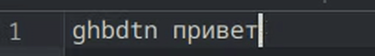

# layout-fix

Select text typed in the wrong keyboard layout, press one shortcut, and it is
replaced in place — `ghbdtn` becomes `привет` — with the system keyboard
layout switched to match. Built for **KDE Plasma on Wayland**.

Think Punto Switcher on Windows, or X-Neur on X11 — this is the equivalent
Linux keyboard layout switcher for a Wayland desktop, where neither of them
runs.



```
ghbdtn, Vbh!                    ->  Приветб Мир!
yt kexit kb b[ elfkznm          ->  не лучше ли их удалять
ghbdtn руддщ                    ->  привет hello
```

The last line is the point of difference: mixed text is converted token by
token, each word in the layout it was actually typed in, rather than flipping
the whole selection through one alphabet.

## Why this exists

There was nothing to use on KDE Wayland. `xneur`/`gxneur` are X11-only and
have not moved since 2024; [`retypex`](https://github.com/Lyssten/retypex) is
the closest live project but is tied to Hyprland and keeps a daemon on
`uinput` that passively reads every keystroke; everything else is Windows or
macOS. This tool holds no keyboard grab and runs nothing in the background
except a private clipboard session.

## How it works

1. The selection is read from the Wayland primary selection (`wl-paste -p`).
2. Each whitespace-separated token is classified by the layout its letters
   belong to and converted to the other layout.
3. The clipboard is snapshotted, the converted text is copied and pasted with
   `ydotool`, and the previous clipboard is restored.
4. The KDE keyboard layout is switched to the one the converted text is in.

The shortcut itself is deliberately indirect: Input Remapper turns
`Left Ctrl+Space` into `F24`, and KDE binds `F24` to the desktop entry. This
avoids grabbing a key combination that applications also use.

The clipboard snapshot goes through a private CopyQ session so that all MIME
types survive the paste, not just plain text. An image clipboard is saved and
restored byte for byte through `wl-clipboard`.

## Requirements

- KDE Plasma on Wayland (`org.kde.keyboard` D-Bus interface)
- Python 3.11 or newer (for `tomllib`)
- `copyq`
- `wl-clipboard` (`wl-paste`, `wl-copy`)
- `ydotool` with a running daemon on `/tmp/.ydotool_socket`
- `input-remapper`
- `gdbus` and `notify-send`

On Fedora:

```bash
sudo dnf install copyq wl-clipboard ydotool input-remapper glib2 libnotify
```

## Install

```bash
git clone <this repository>
cd layout-fix
./install.sh
```

The script installs `~/.local/bin/layout-fix`, the user units and the desktop
entry, writes a default `~/.config/layout-fix/layouts.toml`, and starts the
private CopyQ session. It then prints the two steps that depend on your own
hardware and desktop: recording the `Left Ctrl+Space` → `F24` mapping in the
Input Remapper GUI, and binding `F24` to "Fix Keyboard Layout" in
System Settings → Keyboard → Shortcuts → Applications.

`./install.sh --uninstall` removes everything it installed and leaves your
configuration alone.

## Configuring layouts

Layout tables live in `~/.config/layout-fix/layouts.toml`. Generate a pair
from the XKB definitions your system already has, instead of typing it out:

```bash
layout-fix --generate-layouts us ru > ~/.config/layout-fix/layouts.toml
```

Both arguments are XKB layout names, optionally with a variant
(`us:dvorak`). `us ua`, `us de`, `us gr` and `us il` all work; anything
`xkeyboard-config` knows is worth trying. `layout-fix --dump-layouts` prints
the built-in US/Russian tables if you would rather start from those.

The result is a pair mapping the two layouts to each other row by row. Both
strings of a row must be the same length, and shifted characters go in the
same row as the unshifted ones:

```toml
active = "us-ru"

[[pairs]]
name = "us-ru"
first = "us"
second = "ru"
first_kde_index = 0
second_kde_index = 1
rows = [
    ["qQwWeErRtTyYuUiIoOpP[{]}", "йЙцЦуУкКеЕнНгГшШщЩзЗхХъЪ"],
    ["aAsSdDfFgGhHjJkKlL;:'\"", "фФыЫвВаАпПрРоОлЛдДжЖэЭ"],
]
```

`first_kde_index` and `second_kde_index` are positions in your KDE layout
list:

```bash
gdbus call --session --dest org.kde.keyboard --object-path /Layouts \
    --method org.kde.KeyboardLayouts.getLayoutsList
```

Define as many `[[pairs]]` as you like and choose one with `active`. Which
characters count as letters — and therefore drive layout detection — is
derived from the rows, so a new pair needs no code changes.

Known limitation: one pair is active at a time. A three-layout setup has to
pick which two the shortcut converts between.

## Usage

Select text, press `Left Ctrl+Space`. Nothing else.

```bash
layout-fix --convert 'ghbdtn'          # convert a string, touch nothing else
layout-fix --generate-layouts us ru    # build layout tables from XKB
layout-fix --dump-layouts              # print the built-in tables
layout-fix --self-test                 # run the offline test suite
layout-fix --version
```

## Development

```bash
python3 src/layout-fix --self-test
python3 -m py_compile src/layout-fix
```

The self-test is offline: it covers the conversion rules, the configuration
parser (including malformed configurations) and the clipboard MIME selection,
without touching the clipboard or the desktop.

## Troubleshooting

**The shortcut does nothing.** Check the chain one link at a time. First,
whether the key reaches KDE at all — this should run the tool:

```bash
YDOTOOL_SOCKET=/tmp/.ydotool_socket ydotool key 194:1 194:0
```

If that works but `Left Ctrl+Space` does not, the Input Remapper preset is not
loaded: `systemctl --user status layout-fix-input-remapper.service`. If it
does not work either, F24 is not bound to "Fix Keyboard Layout" in
System Settings → Keyboard → Shortcuts → Applications.

**"Could not paste the converted text. Check ydotoold."** The daemon is not
running or its socket is elsewhere:

```bash
systemctl status ydotool     # or: ydotoold &
ls -l /tmp/.ydotool_socket
```

`ydotoold` needs access to `/dev/uinput`. On Fedora the service unit handles
this; started by hand, it usually needs `sudo` or a udev rule granting your
user access to `/dev/uinput`.

**"Select some text first."** The tool reads the Wayland primary selection,
which is set by selecting text with the mouse. A few applications do not
publish a keyboard-made selection there; select with the mouse to check, and
compare with `wl-paste --primary`.

**The text converts but the layout does not switch.** Your KDE layout indices
differ from the configuration. List them and correct `first_kde_index` and
`second_kde_index` in `~/.config/layout-fix/layouts.toml`:

```bash
gdbus call --session --dest org.kde.keyboard --object-path /Layouts \
    --method org.kde.KeyboardLayouts.getLayoutsList
```

**"Could not save the clipboard."** The private clipboard session is not
running:

```bash
systemctl --user status layout-fix-clipboard.service
```

**Nothing happens and no notification appears.** Run the conversion directly
to separate the converter from the desktop integration:

```bash
layout-fix --convert 'ghbdtn'   # expects: привет
layout-fix --self-test
```

## License

GPL-3.0-or-later. See [LICENSE](LICENSE).

## Repository layout

```
src/layout-fix                 the program, a single Python file
install.sh                     per-user installer and uninstaller
config/                        templates install.sh renders into place
examples/input-remapper-2/     reference Input Remapper mapping
```
